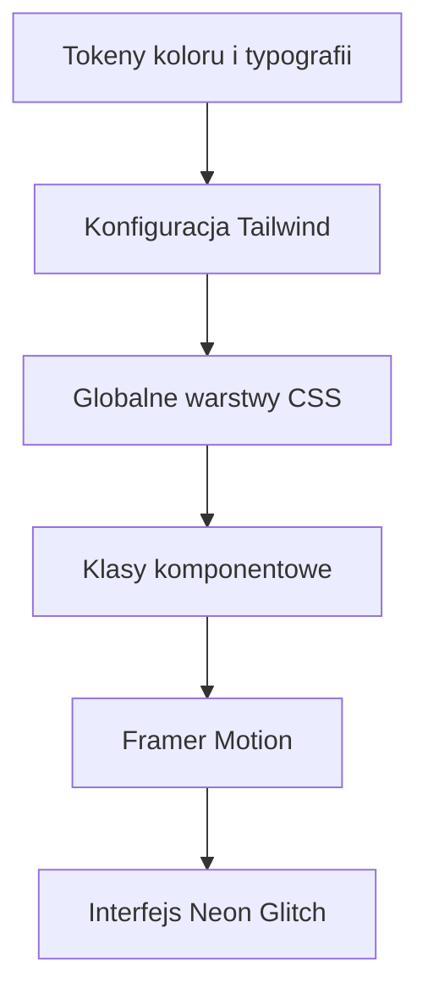
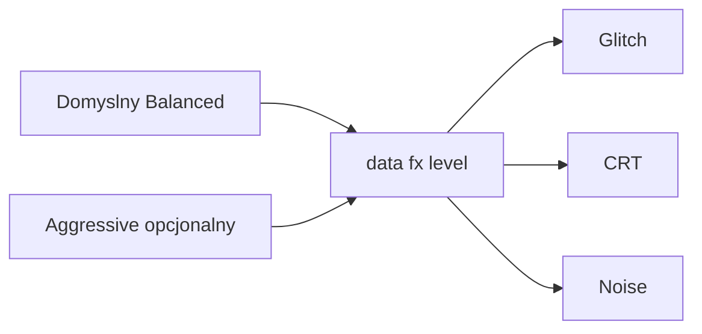

# Neon Glitch Spec dla GUI Web UESE

## 0. Status wznowienia i decyzje

- Ten dokument domyka specyfikację pod wdrożenie w trybie Code.
- Model efektów ma przełącznik intensywności:
  - domyślnie **Balanced**
  - opcjonalnie **Aggressive**
- Logika backend scan patch batch zostaje bez zmian.

## 1. Analiza wizualna na bazie moodboardu cyberpunk neon glitch

### 1.1 Wnioski stylistyczne

1. Najmocniejszy charakter daje duet **cyan plus magenta** na bardzo ciemnym tle.
2. Czytelność utrzymuje się, gdy neon działa jako akcent, nie jako pełne tło tekstu.
3. Klimat glitch budują warstwy:
   - split RGB na tytule
   - pojedyncze linie zakłóceń
   - delikatny noise i scanline
4. Panelowy UI powinien pozostać funkcjonalny:
   - mocny kontrast pól input
   - spokojna typografia dla danych liczbowych
   - agresywniejsze efekty tylko na CTA i brand.

### 1.2 Priorytet UX

1. Czytelność formularzy patchowania i tabel kandydatów.
2. Natychmiastowa rozpoznawalność statusu online offline i warning.
3. Efekt wow przez motion bez męczenia wzroku.

## 2. Paleta kolorów i tokeny

### 2.1 Core palette hex

| Token | Hex | Użycie |
|---|---|---|
| bg-void | `#05030B` | najciemniejsze tło |
| bg-deep | `#0B0A1A` | gradient warstwy bazowej |
| bg-surface | `#101225` | tła paneli |
| neon-cyan | `#35F3FF` | primary accent i glow |
| neon-pink | `#FF2BD6` | secondary accent i glitch split |
| cyber-yellow | `#FFD84D` | warning i glitch streak |
| toxic-lime | `#B8FF5C` | success i status online |
| electric-purple | `#9D4DFF` | dodatkowy blob i highlight |
| danger-hot | `#FF5A7A` | error danger |
| text-main | `#EEF3FF` | główny tekst |
| text-dim | `#9AA8C7` | tekst pomocniczy |

### 2.2 Semantyka

- accent-primary = neon-cyan
- accent-secondary = neon-pink
- accent-warning = cyber-yellow
- accent-success = toxic-lime
- accent-danger = danger-hot

## 3. Typografia i importy

### 3.1 Stack fontów

- Body UI: **Space Grotesk**
- Mono techniczne i offsety: **IBM Plex Mono**
- Display glitch do krótkich etykiet: **VT323**

### 3.2 Linki do Google Fonts

- Space Grotesk: https://fonts.google.com/specimen/Space+Grotesk
- IBM Plex Mono: https://fonts.google.com/specimen/IBM+Plex+Mono
- VT323: https://fonts.google.com/specimen/VT323

### 3.3 Instrukcja importu preferowana

Opcja A repo local z `@fontsource`.

Pakiety do dodania:

- `@fontsource/ibm-plex-mono`
- `@fontsource/vt323`

Importy do wpisania w `main.jsx`:

```js
import "@fontsource/space-grotesk/400.css";
import "@fontsource/space-grotesk/600.css";
import "@fontsource/space-grotesk/700.css";
import "@fontsource/ibm-plex-mono/400.css";
import "@fontsource/ibm-plex-mono/600.css";
import "@fontsource/vt323/400.css";
```

## 4. Efekty i przełącznik intensywności

### 4.1 Domyślne poziomy

| Parametr | Balanced domyślny | Aggressive |
|---|---|---|
| glitch amplitude | `1px` | `2.5px` |
| glitch frequency | hover active | hover active plus co jakiś czas idle w nagłówku |
| scanline opacity | `0.08` | `0.12` |
| noise opacity | `0.14` | `0.22` |
| warning flicker | tylko warning | warning plus CTA danger |

### 4.2 Model techniczny przełącznika

W CSS trzymać zmienne efektów:

```css
:root,
[data-fx-level="balanced"] {
  --fx-glitch-amp: 1px;
  --fx-noise-opacity: 0.14;
  --fx-scan-opacity: 0.08;
  --fx-flicker-speed: 2.8s;
}

[data-fx-level="aggressive"] {
  --fx-glitch-amp: 2.5px;
  --fx-noise-opacity: 0.22;
  --fx-scan-opacity: 0.12;
  --fx-flicker-speed: 1.6s;
}
```

Rekomendacja wdrożenia: `data-fx-level` ustawiać na `body` albo `.app-shell`.

## 5. Konkretne klasy Tailwind CSS do dodania

### 5.1 Rozszerzenie `tailwind.config.js`

```js
extend: {
  colors: {
    bgVoid: "#05030B",
    bgDeep: "#0B0A1A",
    bgSurface: "#101225",
    neonCyan: "#35F3FF",
    neonPink: "#FF2BD6",
    cyberYellow: "#FFD84D",
    toxicLime: "#B8FF5C",
    electricPurple: "#9D4DFF",
    dangerHot: "#FF5A7A",
    textMain: "#EEF3FF",
    textDim: "#9AA8C7"
  },
  boxShadow: {
    "neon-cyan": "0 0 0 1px rgba(53,243,255,.35), 0 0 24px rgba(53,243,255,.22)",
    "neon-pink": "0 0 0 1px rgba(255,43,214,.35), 0 0 24px rgba(255,43,214,.22)",
    "pixel-frame": "inset 0 0 0 1px rgba(255,255,255,.04), 0 0 0 1px rgba(53,243,255,.14)"
  },
  backgroundImage: {
    "crt-lines": "repeating-linear-gradient(180deg, rgba(255,255,255,var(--fx-scan-opacity)) 0 1px, transparent 1px 3px)",
    "neon-radial": "radial-gradient(circle at 20% 10%, rgba(53,243,255,.18), transparent 34%), radial-gradient(circle at 88% 20%, rgba(255,43,214,.16), transparent 36%)"
  },
  fontFamily: {
    sans: ["Space Grotesk", "Avenir Next", "Segoe UI", "sans-serif"],
    mono: ["IBM Plex Mono", "SFMono-Regular", "Menlo", "monospace"],
    display: ["VT323", "monospace"]
  },
  keyframes: {
    "glitch-shift": {
      "0%, 100%": { transform: "translateX(0)" },
      "20%": { transform: "translateX(var(--fx-glitch-amp))" },
      "40%": { transform: "translateX(calc(var(--fx-glitch-amp) * -1))" },
      "60%": { transform: "translateX(calc(var(--fx-glitch-amp) * .5))" }
    },
    "crt-flicker": {
      "0%, 100%": { opacity: "1" },
      "50%": { opacity: ".94" }
    },
    "neon-pulse": {
      "0%, 100%": { boxShadow: "0 0 0 rgba(53,243,255,0)" },
      "50%": { boxShadow: "0 0 18px rgba(53,243,255,.36)" }
    },
    "micro-jitter": {
      "0%, 100%": { transform: "translate(0,0)" },
      "25%": { transform: "translate(-1px, 1px)" },
      "75%": { transform: "translate(1px, -1px)" }
    }
  },
  animation: {
    glitch: "glitch-shift .45s steps(2, end)",
    flicker: "crt-flicker var(--fx-flicker-speed) linear infinite",
    pulseNeon: "neon-pulse 2.6s ease-in-out infinite",
    jitter: "micro-jitter .2s linear"
  }
}
```

### 5.2 Klasy CSS custom do dopisania w `index.css`

Minimalny zestaw battle ready:

- `.panel-cyber`
- `.pixel-border`
- `.neon-text`
- `.glitch-title`
- `.btn-neon-main`
- `.btn-neon-sub`
- `.crt-mask`
- `.warning-row`
- `.terminal-box`

Definicje docelowe:

```css
.panel-cyber {
  background: rgba(16, 18, 37, 0.76);
  border: 1px solid rgba(53, 243, 255, 0.24);
  box-shadow: 0 0 0 1px rgba(255, 43, 214, 0.12), 0 16px 38px rgba(0, 0, 0, 0.45);
}

.pixel-border {
  position: relative;
}

.pixel-border::before {
  content: "";
  position: absolute;
  inset: 0;
  pointer-events: none;
  clip-path: polygon(0 6px, 6px 0, calc(100% - 6px) 0, 100% 6px, 100% calc(100% - 6px), calc(100% - 6px) 100%, 6px 100%, 0 calc(100% - 6px));
  border: 1px solid rgba(53, 243, 255, 0.35);
}

.neon-text {
  color: #35F3FF;
  text-shadow: 0 0 8px rgba(53,243,255,.55), 0 0 18px rgba(255,43,214,.22);
}

.glitch-title {
  position: relative;
  font-family: "VT323", monospace;
  letter-spacing: .05em;
}

.glitch-title::before,
.glitch-title::after {
  content: attr(data-text);
  position: absolute;
  inset: 0;
  pointer-events: none;
}

.glitch-title::before {
  transform: translateX(var(--fx-glitch-amp));
  color: rgba(53,243,255,.65);
  mix-blend-mode: screen;
}

.glitch-title::after {
  transform: translateX(calc(var(--fx-glitch-amp) * -1));
  color: rgba(255,43,214,.65);
  mix-blend-mode: screen;
}

.btn-neon-main {
  background: linear-gradient(120deg, #35F3FF, #B8FF5C);
  color: #05030B;
  box-shadow: 0 10px 28px rgba(53,243,255,.35);
}

.btn-neon-sub {
  border: 1px solid rgba(53,243,255,.42);
  background: rgba(11,10,26,.72);
  color: #EEF3FF;
}

.crt-mask::before {
  content: "";
  position: absolute;
  inset: 0;
  pointer-events: none;
  background: repeating-linear-gradient(180deg, rgba(255,255,255,var(--fx-scan-opacity)) 0 1px, transparent 1px 3px);
  mix-blend-mode: soft-light;
}

.crt-mask::after {
  content: "";
  position: absolute;
  inset: 0;
  pointer-events: none;
  background: rgba(255,255,255,var(--fx-noise-opacity));
  -webkit-mask-image: url("./assets/noise-mask.svg");
  mask-image: url("./assets/noise-mask.svg");
}
```

## 6. Opis efektów glitch i CRT overlay

### 6.1 Glitch

- Tylko dla:
  - główny nagłówek brand
  - 2 do 3 kluczowe CTA
  - aktywne taby
- Nie używać na inputach i wartościach liczbowych.
- Trigger:
  - Balanced: hover i active
  - Aggressive: hover active plus rzadki idle pulse na brand title

### 6.2 CRT overlay

- Warstwa scanline przez pseudo-element.
- Warstwa noise przez maskę SVG.
- Limity:
  - opacity scanline do 0.12
  - opacity noise do 0.22
- W `prefers-reduced-motion` wyłączyć flicker jitter glitch auto.

## 7. Status i kompletność assetów SVG

### 7.1 Wynik walidacji

- `gui-web/src/assets/neon-grid-bg.svg` jest **kompletny**:
  - gradient bazowy
  - radialne bloby cyan pink purple
  - podwójna siatka
  - linie glitch
- `gui-web/src/assets/noise-mask.svg` jest **kompletny**:
  - proceduralny noise przez `feTurbulence`
  - kontrola alfa przez `feColorMatrix`
  - kafel 256

### 7.2 Decyzja

Brak konieczności generowania nowych plików SVG na tym etapie.

## 8. Plan zmian per plik dla trybu Code

### 8.1 `gui-web/package.json`

- dodać zależności fontów `@fontsource/ibm-plex-mono` i `@fontsource/vt323`

### 8.2 `gui-web/src/main.jsx`

- dodać importy nowych fontów

### 8.3 `gui-web/tailwind.config.js`

- rozszerzyć `extend` o colors boxShadow backgroundImage fontFamily keyframes animation

### 8.4 `gui-web/src/index.css`

- przepisać tokeny kolorów
- dodać przełącznik `data-fx-level`
- dodać klasy `panel-cyber` `pixel-border` `glitch-title` `crt-mask` `btn-neon-main` `btn-neon-sub`
- zaktualizować istniejące `panel` `tab-btn` `field` `chip` `terminal-box` `warning-row`

### 8.5 `gui-web/src/App.css`

- podbić styl `character-selector` pod pixel frame i dual glow aktywnego chipa

### 8.6 `gui-web/src/App.jsx`

- podmienić copy CTA:
  - Run Smart Scan → YEET THE SAVES
  - Execute Patch → BREAK THE GAME
  - Execute Batch Patch → MASS CHAOS PATCH
- dodać `data-text` dla glitch title
- przypisać nowe klasy do paneli przycisków i sekcji CRT

## 9. Motion spec Framer Motion

### 9.1 Tab transitions

- enter: opacity `0 -> 1`, y `14 -> 0`, lekki skew
- exit: opacity `1 -> 0`, y `0 -> -12`

### 9.2 CTA

- hover jitter: `x [0, -1, 1, 0]`, `y [0, 1, -1, 0]`
- tap: `scale 0.98`
- disabled: bez jitter, obniżona saturacja

### 9.3 Candidate rows i log stream

- score fill ze spring
- log line enter `x -10 -> 0`, `opacity 0 -> 1`

## 10. Guardrails jakości

- WCAG AA dla pól formularza i tekstów statusów
- brak ciągłego shake dla inputów
- max dwa mocne glow jednocześnie na jednym widoku
- test na mobile dla batch grid i sticky nav
- test `prefers-reduced-motion`

## 11. Checklist wdrożeniowy battle ready

1. Dodać font dependencies i importy.
2. Rozszerzyć Tailwind theme i animacje.
3. Przepisać globalny theme i klasy Neon Glitch w CSS.
4. Podmienić klasy i copy w App.
5. Włączyć przełącznik `data-fx-level` z domyślnym Balanced.
6. Przetestować kontrast i responsywność.
7. Potwierdzić brak zmian w logice backend.

## 12. Mermaid przepływ warstw stylu



## 13. Mermaid przełącznik efektów


